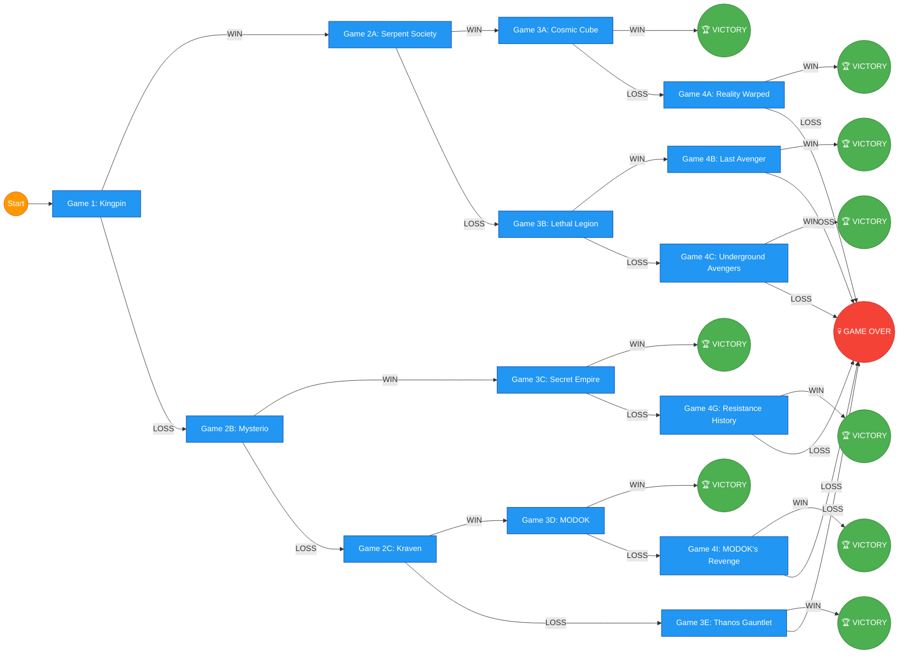

# Marvel United: Earth's Mightiest – A Branching Campaign

## Campaign Overview: "Shadows Over New York"

**Starting Roster:** Spider-Man, Iron Man, Captain America, Thor, Black Widow, Hulk (choose 4 per game, but all are available)

**Tone:** Begins with street-level crime, escalates to cosmic threats and Earth-shattering events.

**Theme:** This campaign treats New York City as the heart of the Marvel Universe. Every villain wants a piece of it, and the Heroes must defend it while uncovering a conspiracy that links street crime to intergalactic warlords.

---

## ACT 1: Street Level

### Game 1: "The Big Apple's Underbelly"
**Villain:** Kingpin

**Setup:** New York City location mandatory.

**Story:** A wave of organized crime has hit the city. The Kingpin is consolidating power, but there's talk of a mysterious buyer funding his operations. The Heroes must dismantle his operation.

**Win Condition:** Defeat Kingpin. The Heroes discover the buyer is the Serpent Society. Proceed to Game 2A.

**Loss Condition:** Kingpin consolidates power. The Heroes regroup, but the buyer begins making moves. Proceed to Game 2B.

### Game 1B (Alternate Loss Path): "Night Falls on NYC"
**Villain:** Mysterio (or Kraven the Hunter as backup)

**Story:** With the Heroes disorganized, street-level villains sense weakness. Mysterio creates chaos across the city with elaborate illusions.

**Win:** Defeat Mysterio. The Heroes learn the illusions were hiding a larger operation—Hydra activity. Proceed to Game 2C.

**Loss:** The illusions cause mass panic. The Heroes are blamed for the chaos. Proceed to Game 2D with a permanent reputation penalty.

---

## ACT 2: The Conspiracy Deepens

### Game 2A (Won Game 1): "Serpent's Strike"
**Villain:** Serpent Society (use a single villain representative, e.g., Cottonmouth or Bushmaster)

**Story:** The Serpent Society is the buyer Kingpin was working with. But they are merely proxies for a larger organization—HYDRA.

**Win:** Defeat the Serpent Society. New Hero added: Daredevil. Proceed to Game 3A.

**Loss:** The Serpent Society escapes with a stolen artifact. Proceed to Game 3B.

### Game 2B (Lost Game 1): "The Buyer Revealed"
**Villain:** Red Skull

**Story:** Kingpin's victory exposes his buyer: the Red Skull. HYDRA is funding criminal elements to destabilize the city before a full invasion.

**Special Rule:** HYDRA troop tokens appear as minions throughout the game.

**Win:** Defeat Red Skull. HYDRA's plan is exposed, but the true scale is yet unknown. New Hero added: Falcon. Proceed to Game 3C.

**Loss:** Red Skull secures his foothold. Proceed to Game 3D with HYDRA having a permanent advantage.

### Game 2C (Won Game 1B): "Ghosts of HYDRA"
**Villain:** Madame Hydra (Viper)

**Story:** Mysterio's illusions were a cover for HYDRA to steal advanced Stark technology. The Heroes must stop Viper before she weaponizes it.

**Win:** Defeat Viper. The Heroes learn HYDRA is working with something far worse. Proceed to Game 3E.

**Loss:** The technology is stolen. Proceed to Game 3F.

### Game 2D (Lost Game 1B): "Hunted"
**Villain:** Kraven the Hunter

**Story:** With the Heroes disgraced and reputation tarnished, Kraven sees the perfect opportunity to hunt them on live television.

**Special Rule:** The Heroes are "hunted"—the Villain deals +1 damage for each Hero with 2 or fewer health remaining.

**Win:** Defeat Kraven. The Heroes restore some public faith. Proceed to Game 3G.

**Loss:** Kraven successfully captures a Hero. That Hero cannot be used in the next game. Proceed to Game 3H.

---

## ACT 3: The Cosmic Stage

### Game 3A (Path: 2A Win): "The Cosmic Cube"
**Villain:** Thanos (or Red Skull if Thanos unavailable)

**Story:** The Serpent Society stole an artifact—the Tesseract. Red Skull and Thanos are both racing to acquire it. The Heroes must stop them both before reality itself is rewritten.

**Special Rule:** Two villains are active during the game (play as a double-villain battle).

**Win:** Defeat both villains. Campaign Victory! The Tesseract is secure.

**Loss:** The cube is activated. Proceed to Game 4A for a final reality-warping battle.

### Game 3B (Path: 2A Loss): "Lethal Legion"
**Villain:** Baron Zemo

**Story:** With the artifact stolen, HYDRA is on the brink of global control. Zemo leads the Lethal Legion to crush the Heroes.

**Win:** Defeat Zemo. Proceed to Game 4B.

**Loss:** HYDRA controls the city. Proceed to Game 4C—the resistance.

### Game 3C (Path: 2B Win): "HYDRA's Reach"
**Villain:** Arnim Zola (or MODOK)

**Story:** HYDRA has infiltrated S.H.I.E.L.D. The Heroes must stop Zola from launching a global satellite network that will give HYDRA total surveillance control.

**Special Rule:** S.H.I.E.L.D. agents appear as both allies and enemies (some are HYDRA in disguise).

**Win:** Defeat Zola. Campaign Victory! S.H.I.E.L.D. is cleansed.

**Loss:** HYDRA gains control of the satellites. Proceed to Game 4D.

### Game 3D (Path: 2B Loss): "Invasion"
**Villain:** Ultron

**Story:** HYDRA uses captured Stark technology to activate Ultron. The world's defenses are turned against themselves.

**Win:** Defeat Ultron. Proceed to Game 4E.

**Loss:** Ultron spreads globally. Proceed to Game 4F.

### Game 3E (Path: 2C Win): "Secret Empire"
**Villain:** Hydra Supreme (Captain America variant)

**Story:** Hydra has rewritten history—Captain America has been revealed to be a Hydra agent all along. The Heroes face their greatest shock.

**Special Rule:** The Hero with the highest Health is revealed as "Hydra Supreme" at start (swap their role for one game—they control a special Villain deck).

**Win:** Defeat Hydra Supreme. Restore history. Campaign Victory!

**Loss:** Hydra's history remains. Proceed to Game 4G.

### Game 3F (Path: 2C Loss): "Annihilation"
**Villain:** Annihilus

**Story:** HYDRA's stolen technology opens a dimensional rift. Annihilus and the Negative Zone invade.

**Win:** Defeat Annihilus. Close the rift. Proceed to Game 4H.

**Loss:** The Negative Zone consumes Earth. Game Over.

### Game 3G (Path: 2D Win): "A.I.M. at World Domination"
**Villain:** MODOK

**Story:** With Kraven defeated, the Heroes investigate the source of the chaos—A.I.M. and MODOK were pulling strings all along.

**Win:** Defeat MODOK. Campaign Victory! A.I.M. is dismantled.

**Loss:** MODOK escapes with crucial data. Proceed to Game 4I.

### Game 3H (Path: 2D Loss): "The Gauntlet"
**Villain:** Thanos (with Infinity Gauntlet—limit to 1-2 stones)

**Story:** With a Hero captured and the Heroes at their weakest, Thanos sees his moment. He arrives with the Infinity Gauntlet. This is their last chance.

**Special Rule:** Thanos has 2 Infinity Stones active. Each stone grants him a special ability.

**Win:** Defeat Thanos. Campaign Victory! The universe is saved.

**Loss:** Thanos snaps. Game Over.

---

## ACT 4: Final Confrontations

### Game 4A (3A Loss): "Reality Warped"
**Villain:** Thanos (full Infinity Gauntlet)

**Story:** The cube activated. Reality is unraveling. The Heroes must face Thanos in a broken reality.

**Win:** Defeat Thanos and restore reality. Campaign Victory!

**Loss:** Reality collapses. Game Over.

### Game 4B (3B Win): "The Last Avenger"
**Villain:** Red Skull

**Story:** Zemo is defeated, but Red Skull remains. He unleashes the final HYDRA weapon.

**Win:** Defeat Red Skull. Campaign Victory! HYDRA is finally ended.

**Loss:** The weapon deploys. Game Over.

### Game 4C (3B Loss): "Underground Avengers"
**Villain:** Thanos

**Story:** HYDRA has won, but the resistance fights on. Underground, the Heroes prepare for one final strike.

**Win:** Defeat Thanos and free the city. Campaign Victory!

**Loss:** The resistance is crushed. Game Over.

### Game 4D (3C Loss): "Network Down"
**Villain:** Ultron (global form)

**Story:** HYDRA's satellites have activated. Ultron, or an Ultron-like entity, is everywhere. The Heroes must physically destroy the server core.

**Win:** Destroy the core. Campaign Victory!

**Loss:** Ultron achieves global domination. Game Over.

### Game 4E (3D Win): "The Ultron Offensive"
**Villain:** Ultron (enhanced)

**Story:** Ultron is down but not destroyed. He returns with an army of drones.

**Win:** Defeat Ultron for good. Campaign Victory!

**Loss:** Ultron becomes unstoppable. Game Over.

### Game 4F (3D Loss): "Age of Ultron"
**Villain:** Ultron (Prime)

**Story:** Ultron rules the world. The Heroes must fight through his drone army to reach his core.

**Special Rule:** Start with a "Drone Swarm" token on the board that must be cleared before Ultron can be targeted.

**Win:** Defeat Ultron. Campaign Victory!

**Loss:** Ultron's age continues. Game Over.

### Game 4G (3E Loss): "Resistance History"
**Villain:** Hydra Supreme

**Story:** The rewritten history must be undone. The resistance fights to restore the timeline.

**Win:** Defeat Hydra Supreme and restore the true timeline. Campaign Victory!

**Loss:** Hydra's history becomes permanent. Game Over.

### Game 4H (3F Win): "Annihilation Wave"
**Villain:** Annihilus (Final Form)

**Story:** The rift is closing, but Annihilus is enraged. He unleashes his full power.

**Win:** Defeat Annihilus. The rift closes. Campaign Victory!

**Loss:** The Negative Zone expands. Game Over.

### Game 4I (3G Loss): "M.O.D.O.K.'s Revenge"
**Villain:** MODOK (Enhanced)

**Story:** MODOK escapes and uploads his consciousness into a super-suit.

**Win:** Defeat MODOK. Campaign Victory!

**Loss:** MODOK's mind controls the world. Game Over.

---

## Campaign Rules

- **Starting Heroes:** Choose 4 of the 6 suggested starters per game. New Heroes can be added via story branches.
- **Location:** All games set in New York City unless otherwise specified.
- **Branches:** Winning or losing changes the story direction and available villains.
- **Permanent Consequences:** Some losses add permanent penalties (lost Heroes, reputation damage, etc.).
- **Victory:** Multiple paths lead to victory—no single "canon" ending.

---

## Required Components

- **Core Game:** Marvel United (base set)
- **Expansions:** Marvel United: Spider-Man, Avengers, Guardians of the Galaxy, or any characters referenced above (Thanos, Ultron, etc.)
- **Optional:** Comic or movie-inspired custom decks for the specific villains listed.

---

## Suggested Hero/Villain Substitutions

If you don't own a specific character, substitute with a similar one:

- Kingpin → Any organized crime villain (e.g., Hammerhead)
- Red Skull → Any HYDRA leader (e.g., Baron Strucker)
- Thanos → Any cosmic villain (e.g., Ronan the Accuser)
- Annihilus → Any dimensional invader (e.g., Dormammu)
- MODOK → Any tech-based villain (e.g., Doctor Octopus)
- Mysterio → Any illusion-based villain (e.g., Loki)
- Kraven → Any hunter/assassin (e.g., Bullseye)

---
