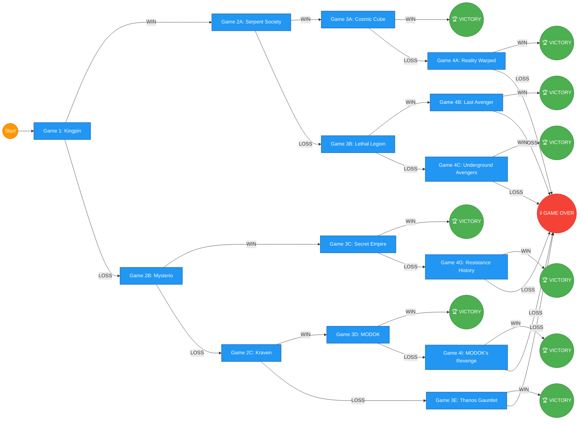

# X-Men: Children of the Atom – A Branching Marvel United Campaign

Based on how official Marvel United Campaign Decks work, each campaign uses Rules cards that define each game's Villain, available Heroes, and special setup, while Event cards trigger based on specific conditions and add consequences for future games . Winning or losing a game can add or remove Heroes, change the story direction, or even lead to campaign failure .

Here's a custom X-Men campaign with branching paths where losses change the story, starting small and escalating in scope.


---

## Campaign Overview: "From the Ashes"

**Starting Roster:** Cyclops, Jean Grey, Beast, Iceman, Angel (the original five X-Men)

**Tone:** Begins with a mysterious threat to the school, escalates to mutant extinction-level events.


---

## NON-X-MEN CAMPAIGN README

```markdown
# Marvel United: Earth's Mightiest – A Branching Campaign

## Campaign Overview: "Shadows Over New York"

**Starting Roster:** Spider-Man, Iron Man, Captain America, Thor, Black Widow, Hulk (choose 4 per game, but all are available)

**Tone:** Begins with street-level crime, escalates to cosmic threats and Earth-shattering events.

**Theme:** This campaign treats New York City as the heart of the Marvel Universe. Every villain wants a piece of it, and the Heroes must defend it while uncovering a conspiracy that links street crime to intergalactic warlords.

---

## Campaign Flow Diagram

### Graph Style (Mermaid.js - Renders on GitHub/GitLab)



---

## ACT 1: Small Potatoes

### Game 1: "Strange Happenings at the School"
**Villain:** Toad (or Pyro if Toad unavailable)

**Setup:** Xavier's School for Gifted Youngsters location mandatory.

**Story:** Strange disturbances are plaguing the mansion—equipment malfunctioning, students scared. The X-Men investigate and find the Brotherhood of Evil Mutants testing the school's defenses.

**Win Condition:** Defeat Toad.

**Loss Condition:** If the Heroes lose, they discover Magneto's hand behind this (proceed to Game 1B). If they win, they capture Toad and learn of a larger plot (proceed to Game 2A).

### Game 1B (Loss Branch): "Magnetic Menace"
**Villain:** Magneto

**Story:** With the school's defenses exposed, Magneto attacks directly, demanding the X-Men join his cause. The team faces their most powerful foe earlier than expected.

**Win:** Defeat Magneto, earning his grudging respect. Proceed to Game 2B.

**Loss:** Magneto cripples the school's defenses. Proceed to Game 2C with a permanent handicap (-1 starting Hero card per player).

---

## ACT 2: Escalation

### Game 2A (Won Game 1): "The Sentinels Awaken"
**Villain:** Sentinel (or Master Mold if available)

**Story:** Toad reveals the Brotherhood was working for a mysterious benefactor—the Sentinels are being deployed to "protect" humanity from mutants. A single Sentinel attacks the school.

**Win:** Destroy the Sentinel. New Hero added to roster: Wolverine. Proceed to Game 3A.

**Loss:** The Sentinel transmits data to its masters. Proceed to Game 3B.

### Game 2B (Won Game 1B): "Unlikely Alliance"
**Villain:** Juggernaut

**Story:** Magneto reveals a greater threat—his old ally Cain Marko has been empowered by an unknown force and is ravaging the Brotherhood's base. He reluctantly asks the X-Men for help.

**Special Rule:** Magneto fights alongside the Heroes as a temporary ally (treat as an extra Hero with his own deck).

**Win:** Defeat Juggernaut. Magneto offers a temporary truce. New Hero added: Gambit. Proceed to Game 3C.

**Loss:** Juggernaut destroys the Brotherhood base. Magneto retreats, and the X-Men are blamed. Proceed to Game 3D.

### Game 2C (Lost Game 1B): "Desperate Defense"
**Villain:** Magneto (rematch)

**Story:** Magneto's attack has left the school vulnerable. Professor Xavier activates Cerebro to find allies, but the process attracts unwanted attention.

**Special Rule:** Start each turn with one fewer Hero card in hand (the school's damage).

**Win:** Repel Magneto's second assault. The X-Men are battered but survive. New Hero added: Rogue. Proceed to Game 3E.

**Loss:** The X-Men are scattered. Proceed to Game 3F with only 3 Heroes available.

---

## ACT 3: The World at Stake

### Game 3A (Path: 2A Win): "Days of Future Past"
**Villain:** Nimrod (or Sentinel Prime)

**Story:** The Sentinel threat was just the beginning. A temporal anomaly opens, and a future Sentinel, Nimrod, arrives to ensure mutant extinction. The X-Men must fight for the future.

**Win:** Defeat Nimrod. Campaign Victory! The timeline is saved. 

**Loss:** The future remains grim. But a new ally arrives—Shadowcat appears from the future. Proceed to Game 4A for a final stand.

### Game 3B (Path: 2A Loss): "The Purifiers Strike"
**Villain:** William Stryker (use a suitable villain like Bastion or any anti-mutant villain)

**Story:** The Sentinel data spreads to anti-mutant groups. The Purifiers attack the school with military precision. This is no longer just a fight—it's a siege.

**Special Rule:** Location: Xavier's School is under siege—Crisis tokens appear more frequently.

**Win:** The X-Men repel the Purifiers. Proceed to Game 4B.

**Loss:** The school falls. The X-Men go into hiding. Proceed to Game 4C—the final battle in hiding.

### Game 3C (Path: 2B Win): "The Juggernaut Unleashed"
**Villain:** Juggernaut (rematch, enhanced)

**Story:** Juggernaut was merely a distraction. His power source, the Cyttorak gem, is now drawing beings from other dimensions. A portal opens, and the X-Men must close it.

**Special Rule:** Random extra Villain appears mid-game via portal.

**Win:** Close the portal and defeat Juggernaut. Campaign Victory! The X-Men gain new allies from the other side.

**Loss:** The portal expands. Proceed to Game 4D to fight a reality-warping threat.

### Game 3D (Path: 2B Loss): "Public Enemies"
**Villain:** Mystique (the X-Men are framed)

**Story:** With Magneto's base destroyed, the X-Men are blamed for the destruction. Mystique and the Brotherhood frame them for global attacks. The X-Men fight to clear their name.

**Win:** Expose Mystique's plot. Proceed to Game 4E.

**Loss:** The X-Men become fugitives. Proceed to Game 4F.

### Game 3E (Path: 2C Win): "Gathering Forces"
**Villain:** Apocalypse's Horseman (select one: War, Pestilence, Famine, or Death—use a powerful villain proxy like Omega Red or Sinister)

**Story:** Magneto's attack has weakened both sides. Apocalypse senses the chaos and sends his Horseman to test the X-Men. Only the strongest will survive.

**Win:** Defeat the Horseman. New Hero added: Psylocke. Proceed to Game 4G.

**Loss:** The Horseman claims a trophy. Proceed to Game 4H with one Hero permanently removed.

### Game 3F (Path: 2C Loss): "The Twelve"
**Villain:** Apocalypse

**Story:** The X-Men are scattered, and Apocalypse knows this is his moment. He gathers twelve powerful mutants to transfer his essence into a new, perfect body. The few X-Men left must stop him.

**Special Rule:** Available Heroes are randomly selected from the surviving roster.

**Win:** Defeat Apocalypse. Proceed to Game 4I.

**Loss:** Apocalypse ascends. Game Over.

---

## ACT 4: Finale

### Game 4A (3A Loss): "Last Stand"
**Villain:** Nimrod (rematch)

**Story:** Shadowcat from the future guides the X-Men to one final battle. The fate of all mutants across time rests on this moment.

**Win:** Defeat Nimrod. Campaign Victory! The X-Men become legends across time. 

**Loss:** The timeline fractures. Game Over.

### Game 4B (3B Win): "The Cure"
**Villain:** Bastion

**Story:** Stryker's forces were just the start. Bastion, a human-Sentinel hybrid, unleashes a "cure" that will end the mutant race. The X-Men must destroy the source before it's deployed.

**Win:** Destroy the cure. Campaign Victory! Mutants are safe.

**Loss:** The cure spreads. Game Over.

### Game 4C (3B Loss): "Underground Resistance"
**Villain:** Master Mold

**Story:** The school has fallen, but the X-Men fight on. In the shadows of Genosha, they take the fight to the Sentinel factory.

**Win:** Destroy Master Mold. Campaign Victory! Freedom for mutants.

**Loss:** The factory produces more Sentinels. Game Over.

### Game 4D (3C Loss): "Reality Check"
**Villain:** Exodus

**Story:** The portal has brought forth Exodus, a powerful psychic who seeks to rewrite reality. The X-Men must enter his mindscape to defeat him.

**Special Rule:** Play in psychic mode—all Heroes have one less Health.

**Win:** Defeat Exodus. Campaign Victory! Reality restored.

**Loss:** Reality is rewritten. Game Over.

### Game 4E (3D Win): "The Trial"
**Villain:** Shadow King

**Story:** Exposed, Mystique unleashes the Shadow King, a psychic entity that feeds on fear. The X-Men must confront their own fears to save the world.

**Special Rule:** Each player starts the game with one random negative Effect card.

**Win:** Banish the Shadow King. Campaign Victory! The X-Men are heroes again.

**Loss:** The Shadow King consumes them. Game Over.

### Game 4F (3D Loss): "Fugitive Justice"
**Villain:** Magneto (now willing to ally)

**Story:** Hunted by humanity, the X-Men have one option—Magneto. He offers them a chance to fight back, but joining him means losing everything they stand for. The X-Men must make a choice.

**Special Rule:** Each Hero can choose to join Magneto (gain +1 Attack but gain a Corruption token) or resist (gain +1 Defense but gain an Exhaustion token).

**Win:** Defeat the human forces attacking Genosha. Campaign Victory! The X-Men walk the line between hero and villain.

**Loss:** The X-Men are captured. Game Over.

### Game 4G (3E Win): "Age of Apocalypse"
**Villain:** Apocalypse

**Story:** The Horseman defeated, Apocalypse arrives personally. He offers a simple choice: join him or be destroyed. The X-Men refuse.

**Win:** Defeat Apocalypse. Campaign Victory! Apocalypse's age is averted.

**Loss:** The Age of Apocalypse begins. Game Over.

### Game 4H (3E Loss): "The Sacrifice"
**Villain:** Apocalypse (enhanced)

**Story:** Apocalypse has taken one of the X-Men. The team fights to save their fallen comrade, knowing one may not return.

**Special Rule:** The captured Hero is added to the Villain's side as a "Horseman" and must be faced.

**Win:** Save the captured Hero. Campaign Victory! The X-Men are whole again.

**Loss:** The captured Hero becomes a permanent Horseman. Game Over.

### Game 4I (3F Win): "Apocalypse Now"
**Villain:** Apocalypse (final form)

**Story:** The Twelve are assembled. This is the final battle for the future of mutantkind.

**Win:** Defeat Apocalypse. Campaign Victory! Mutants unite.

**Loss:** Apocalypse ascends. Game Over.

---

## Campaign Rules Summary

Based on official campaign mechanics :

- **Hero Roster:** Starts with the original five X-Men. New Heroes join based on story branches .
- **Event Cards:** Triggered by specific conditions during each game .
- **Branches:** Losses change the story direction and difficulty.
- **Permanent Consequences:** Some losses add permanent handicaps or remove Heroes .
- **Victory:** Most branches lead to victory through different narrative paths.

---

## Required Components

- **Core Game:** Marvel United: X-Men 
- **Expansions:** Days of Future Past, Phoenix Five, X-Force, Horsemen of the Apocalypse 
- **Optional:** Any X-Men-related villains and Heroes from Marvel United and X-Men expansions